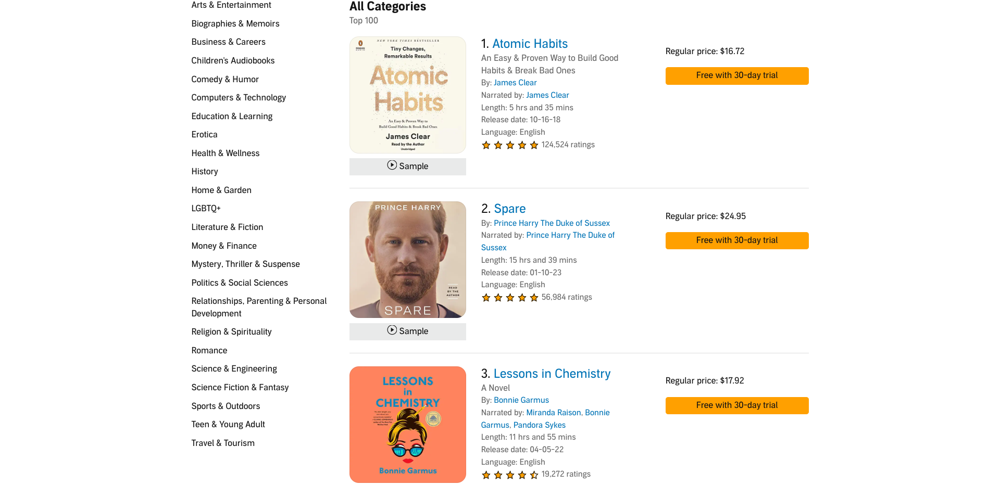

#  Audible.com web scraper - Python with selenium

## About this notebook

Scraping Best Sellers (Top 100) on Audible.com with Python and Selenium on Google colaboratory

    
In this <a href="https://github.com/morikaglobal/audible_selenium/blob/master/Audible%20Selenium.ipynb" target="_blank">notebook</a>, I will scrape Best Sellers section on Audible.com using Python and selenium where Top 100 audio books are listed, and store the scraped then processed data in a csv file.

the link to scrape:
https://www.audible.com/adblbestsellers

robots.txt has been checked and the above link is allowed.

For each audio book, following fields are scraped:
- Book title
- Authors
- Narrators
- Length
- Release date
- Language
- Ratings

On the website, at the time of web scraping in March 2023, 
Best Sellers section looked like this: <a href="https://github.com/morikaglobal/audible_selenium/blob/master/images/AudiblePageLong.png" target="_blank">Best Sellers (Top 100) on Audible.com</a> 

for PDF format: <a href="https://github.com/morikaglobal/audible_selenium/blob/master/images/AudiblePage.pdf" target="_blank">Best Sellers (Top 100) on Audible.com - PDF file</a>

Using my scraping code, data is scraped, necessary data processing done and top 100 Audible audio books are stored in CSV file like this: <a href="https://github.com/morikaglobal/audible_selenium/blob/master/Audible%20Top%20100%20best%20sellers.csv" target="_blank">Top 100 Audible audio books (CSV file)</a>

